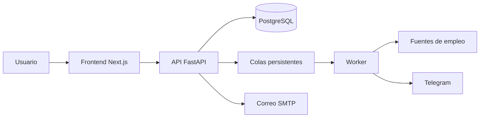

<div align="center">

# JobRadar

### Encuentra oportunidades, recibe alertas y organiza cada candidatura desde un solo lugar.

[](https://github.com/Ciscojes/jobradar/actions/workflows/ci.yml)
[](https://nextjs.org/)
[](https://fastapi.tiangolo.com/)
[](https://www.postgresql.org/)
[](https://www.docker.com/)

[Empezar](#inicio-rápido) · [Funciones](#qué-puedes-hacer) · [Telegram](#avisos-por-telegram) · [Arquitectura](#arquitectura) · [Equipo](#equipo)

</div>

---

## ¿Qué es JobRadar?

JobRadar es una plataforma de búsqueda y seguimiento de empleo. Reúne tus oportunidades, ejecuta búsquedas automáticas según tus preferencias y te avisa por Telegram cuando encuentra nuevas coincidencias.

Cada cuenta mantiene de forma privada sus búsquedas, ofertas, estados de candidatura, perfil profesional e historial de actividad.

## Qué puedes hacer

- Crear una cuenta y completar tu objetivo profesional.
- Guardar búsquedas por puesto, ubicación, modalidad, categoría, salario y fuente.
- Recibir nuevas coincidencias sin mantener la aplicación abierta.
- Conectar de forma segura un Chat ID de Telegram y enviar un mensaje de prueba.
- Organizar oportunidades como **guardadas**, **aplicadas** o **descartadas**.
- Consultar estadísticas sobre el avance de la búsqueda.
- Revisar la actividad de las búsquedas automáticas y manuales.
- Preparar el perfil y comprobar el nivel de preparación del CV.
- Recuperar la contraseña mediante un enlace privado de un solo uso.

## Cómo se utiliza

1. Abre JobRadar y selecciona **Crear cuenta**.
2. Indica el puesto, ubicación y modalidad que prefieres.
3. Crea una o varias búsquedas desde **Búsquedas**.
4. Conecta Telegram desde **Avisos** si deseas recibir notificaciones.
5. Revisa las oportunidades en **Ofertas** y actualiza el estado de cada candidatura.
6. Consulta **Actividad**, **Estadísticas** y **Mi CV** para medir tu avance.

## Inicio rápido

### Requisitos

- Docker Desktop o Docker Engine con Compose.
- Git.
- Credenciales de Adzuna y Telegram únicamente si deseas conectar servicios reales.

### Instalación con Docker

```bash
git clone https://github.com/Ciscojes/jobradar.git
cd jobradar
cp env.example .env
docker compose up --build -d
```

Abre los servicios locales:

| Servicio | Dirección |
|---|---|
| Aplicación JobRadar | <http://localhost:3000> |
| API interactiva | <http://localhost:8000/docs> |
| Correo de desarrollo | <http://localhost:8025> |

El primer arranque crea PostgreSQL, aplica las migraciones y levanta la API, el worker y el frontend oficial.

Para detener la aplicación:

```bash
docker compose down
```

Los datos de PostgreSQL permanecen en un volumen de Docker.

## Recuperación de contraseña

En la pantalla de acceso, selecciona **¿Olvidaste tu contraseña?**. JobRadar enviará un enlace que caduca después de 30 minutos y solo puede utilizarse una vez. Al establecer una contraseña nueva se invalidan las sesiones anteriores.

Durante el desarrollo, los correos se reciben en Mailpit: <http://localhost:8025>. En un despliegue público se utiliza el proveedor SMTP configurado por el administrador.

## Avisos por Telegram

1. Entra en **Avisos**.
2. Crea el enlace privado de vinculación.
3. Abre el bot de Telegram y pulsa **Start**.
4. Regresa a JobRadar y selecciona **Detectar mi chat**.
5. Confirma el chat encontrado y utiliza **Enviar prueba**.

JobRadar no permite registrar un Chat ID arbitrario: el chat debe verificarse mediante el enlace privado antes de activar los avisos.

## Configuración de integraciones

Copia `env.example` como `.env` y completa únicamente las integraciones que vayas a utilizar.

| Variable | Uso |
|---|---|
| `ADZUNA_APP_ID`, `ADZUNA_APP_KEY` | Búsqueda de ofertas en Adzuna |
| `TELEGRAM_BOT_TOKEN` | Envío de avisos desde el bot |
| `TELEGRAM_BOT_USERNAME` | Nombre público del bot |
| `SCRAPER_INTERVAL_MINUTES` | Frecuencia de las búsquedas automáticas |
| `NEXT_PUBLIC_API_URL` | Dirección pública de la API para Next.js |
| `SMTP_*`, `EMAIL_FROM` | Recuperación de contraseña en producción |
| `SECRET_KEY` | Firma de sesiones y tokens privados |

Los valores incluidos en `env.example` son exclusivos para desarrollo. No utilices secretos de ejemplo en un entorno público.

## Arquitectura

JobRadar utiliza un **monolito modular con procesos separados**, una opción más sencilla de operar y adecuada para el tamaño actual del producto.



- **Next.js** ofrece la experiencia del usuario.
- **FastAPI** concentra autenticación, permisos y reglas de negocio.
- **PostgreSQL** guarda datos, trabajos pendientes e historial.
- El **worker** procesa búsquedas y notificaciones sin bloquear la API.
- Los adaptadores aíslan Adzuna, Indeed, InfoJobs, Telegram y SMTP.

No se utilizan microservicios porque todavía no existe una necesidad de escalado o equipos independientes que compense su complejidad operativa. El worker ya separa el procesamiento lento de las peticiones web.

Consulta la [descripción completa de la arquitectura](docs/architecture.md).

## Estructura del proyecto

```text
jobradar/
├── frontend/              # Aplicación principal Next.js
│   ├── src/app/           # Rutas, autenticación y dashboard
│   ├── src/components/    # Componentes compartidos
│   └── Dockerfile         # Imagen standalone de producción
├── app/                   # Backend FastAPI
│   ├── core/              # Seguridad y tokens
│   ├── routers/           # Endpoints HTTP
│   ├── scraper/           # Adaptadores de fuentes de empleo
│   └── services/          # Casos de uso, colas y notificaciones
├── migrations/            # Migraciones de PostgreSQL con Alembic
├── tests/                 # Pruebas unitarias e integración
├── scripts/               # Smoke tests, backup, restauración y carga
├── docs/                  # Arquitectura y operación
├── dashboard/             # Interfaz Streamlit heredada y opcional
├── docker-compose.yml     # Entorno local
└── docker-compose.prod.yml
```

La interfaz Streamlit se conserva temporalmente como alternativa heredada. No se inicia por defecto. Para utilizarla:

```bash
docker compose --profile legacy up dashboard
```

## Desarrollo y calidad

### Backend

```bash
python -m venv .venv
source .venv/bin/activate
pip install --require-hashes -r requirements-dev.lock
ruff check .
pytest -q
```

### Frontend

```bash
cd frontend
npm ci
npm run lint
npm run build
```

La integración continua verifica Python, pruebas con SQLite y PostgreSQL, migraciones, dependencias, archivos de Compose e imágenes de producción.

## Despliegue

1. Copia `.env.production.example` como `.env`.
2. Configura dominios, PostgreSQL, `SECRET_KEY`, CORS, SMTP y las integraciones externas.
3. Ejecuta:

```bash
docker compose -f docker-compose.prod.yml up --build -d
```

4. Comprueba `/health/ready` y ejecuta el smoke test.

La guía completa está en [Preparación para producción](docs/production-readiness.md) y [Runbook operativo](docs/operations-runbook.md).

## Seguridad y privacidad

- Contraseñas almacenadas con PBKDF2 y salt individual.
- Tokens de recuperación almacenados como hash, con caducidad y un solo uso.
- Sesiones anteriores invalidadas al cambiar la contraseña.
- Datos de ofertas, alertas, actividad y notificaciones aislados por usuario.
- Chat ID de Telegram verificado antes de crear un canal.
- Límites de solicitudes compartidos y colas persistentes con reintentos.
- Configuración estricta de CORS, hosts y cabeceras en producción.

## Equipo

JobRadar ha sido posible gracias a:

- [Oliver Lugo](https://github.com/OLIVER26GOLDEN) — backend, FastAPI, base de datos, integraciones y scheduler.
- [Jesús Granados](https://github.com/Ciscojes) — frontend, experiencia del producto, notificaciones, pruebas e ingeniería del proyecto.
- [jciscomora](https://github.com/jciscomora) — contribuciones al desarrollo y evolución del repositorio.

Consulta también el [historial de colaboradores](https://github.com/Ciscojes/jobradar/graphs/contributors).

---

<div align="center">

**Si JobRadar te resulta útil, considera apoyar el proyecto con una estrella.**

</div>
