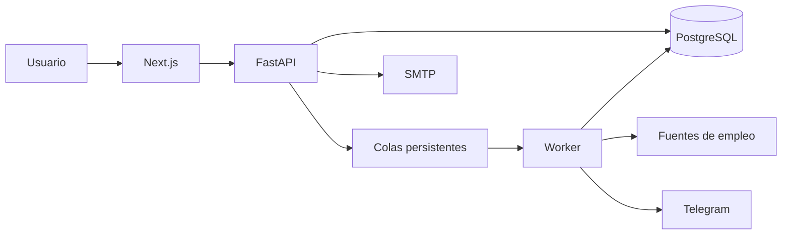

# Arquitectura de JobRadar

## Estilo arquitectónico

JobRadar utiliza un **monolito modular con procesos de ejecución separados**. La lógica de negocio vive en una sola aplicación FastAPI, mientras que el trabajo asíncrono se ejecuta en un worker independiente. El frontend Next.js se despliega como una aplicación separada y se comunica exclusivamente con la API.

Esta arquitectura ofrece límites claros sin asumir el coste operativo de una red de microservicios.

## Unidades de despliegue

| Unidad | Responsabilidad |
|---|---|
| Next.js | Registro, acceso, tablero, alertas, avisos, perfil, CV y estadísticas |
| FastAPI | Autenticación, reglas de negocio, API y validación de permisos |
| Worker | Búsquedas programadas, colas persistentes, reintentos y notificaciones |
| PostgreSQL | Datos de usuarios, ofertas, alertas, trabajos, tokens e historial |
| Mailpit | Captura local de correos durante desarrollo; no se utiliza en producción |
| Streamlit | Interfaz heredada opcional, conservada temporalmente por compatibilidad |

## Flujo principal

1. El usuario crea su cuenta, perfil y búsquedas desde Next.js.
2. FastAPI valida la identidad y guarda cada operación en PostgreSQL.
3. Las búsquedas y notificaciones se registran en colas persistentes.
4. El worker reclama trabajos, consulta proveedores y guarda coincidencias idempotentes.
5. Los avisos verificados se entregan por Telegram; la recuperación de contraseña usa SMTP.

## Límites internos

- `app/routers`: entrada HTTP y autorización.
- `app/services`: casos de uso, ingesta, colas y notificaciones.
- `app/scraper`: adaptadores para proveedores externos.
- `app/core`: primitivas de seguridad.
- `app/models.py` y `app/schemas.py`: persistencia y contratos de la API.
- `frontend/src/app`: rutas y pantallas del producto.
- `migrations`: evolución versionada del esquema.
- `tests`: pruebas de negocio, API, colas, seguridad y migraciones.

## Por qué no microservicios

Separar autenticación, ofertas, alertas y notificaciones en servicios independientes no aporta una ventaja proporcional en la etapa actual. Introduciría coordinación de versiones, autenticación entre servicios, consistencia distribuida, más despliegues y mayor superficie de observabilidad.

El worker ya proporciona el aislamiento más valioso: las tareas lentas y los proveedores externos no bloquean las peticiones web.

La extracción de un microservicio tendría sentido únicamente cuando exista una necesidad demostrable, como:

- escalar el procesamiento de búsquedas de forma muy distinta a la API;
- aislar un proveedor con requisitos operativos o de seguridad propios;
- asignar equipos independientes con ciclos de despliegue diferentes;
- superar la capacidad de PostgreSQL como mecanismo compartido de coordinación;
- necesitar acuerdos de disponibilidad distintos por dominio.

Hasta entonces, mantener módulos claros dentro de FastAPI reduce complejidad y acelera la evolución del producto.

## Reglas de evolución

1. Las pantallas consumen la API; nunca acceden directamente a PostgreSQL.
2. Las operaciones lentas se encolan y son idempotentes.
3. Cada consulta de negocio se limita al usuario autenticado.
4. Los proveedores externos permanecen detrás de adaptadores.
5. Los cambios de esquema siempre incluyen una migración Alembic.
6. Las nuevas unidades de despliegue deben justificarse con una necesidad medible.
